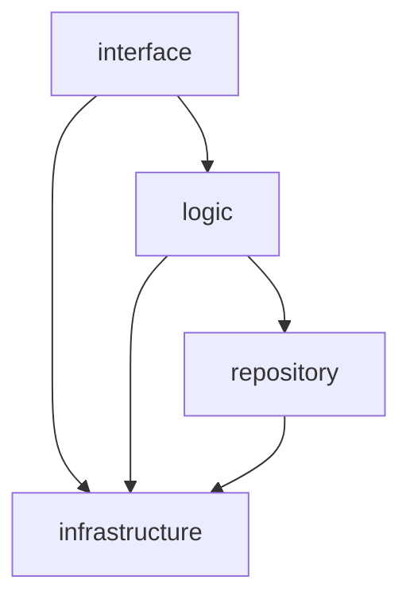
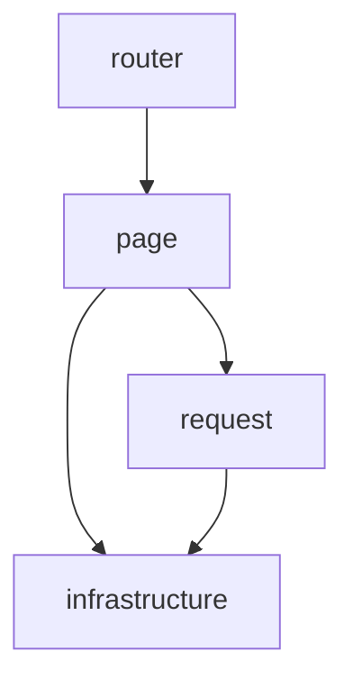

# nail_new — Refactoring Guide

`nail_new` is a complete refactoring of the `nail` project. Every line of the
original code may be legacy baggage; do not take any line at face value. The
following rules must be observed throughout the refactoring.

## 1. Environment

- Development environment: WSL Debian, working directory `/home/qkun`.

## 2. Technology Stack

- Frontend: Leptos in CSR (client-side rendering) mode.
- Proxy: pingap, serving static assets and acting as a reverse proxy.
- Backend: axum, embedding SeekStorm (search engine), agdb (database), and
  moka (cache).

## 3. Project Skeleton (fixed, must not be changed)

```text
nail_new/
|-- README.md
|-- code/
|   |-- back/
|   |   |-- Cargo.toml
|   |   `-- src/
|   |       |-- main.rs
|   |       |-- interface.rs
|   |       |-- interface/
|   |       |-- logic.rs
|   |       |-- logic/
|   |       |-- repository.rs
|   |       |-- repository/
|   |       |-- infrastructure.rs
|   |       `-- infrastructure/
|   |-- common/
|   |   |-- Cargo.toml
|   |   `-- src/
|   |       |-- lib.rs
|   |       |-- zzz.rs
|   |       |-- zzz/
|   |       |-- yyy.rs
|   |       |-- yyy/
|   |       |-- xxx.rs
|   |       `-- xxx/
|   `-- front/
|       |-- Cargo.toml
|       `-- src/
|           |-- main.rs
|           |-- page.rs
|           |-- page/
|           |-- request.rs
|           |-- request/
|           |-- router.rs
|           |-- router/
|           |-- infrastructure.rs
|           `-- infrastructure/
|-- configuration/
|-- data/
|-- log/
|-- document/
`-- test/
```

> Note: `zzz`, `yyy`, and `xxx` are placeholders for the `common` crate's
> submodules (shared data structures and methods). They may be renamed and
> their count may change; every other entry in the skeleton is fixed.

## 4. Architecture

### 4.1 Backend layering and dependency direction (mandatory)



### 4.2 Frontend layering and dependency direction (mandatory)

Derived from the `nail` frontend:

- `main.rs` is the composition root: it wires the layers (provides the
  runtime-config signals, mounts the router).
- `router` only maps URL paths to `page` components.
- `page` renders UI and holds local state; it calls the backend only through
  `request`.
- `request` owns every HTTP call, session-token handling, and `{code, data,
  message}` envelope unwrapping.
- `infrastructure` holds browser/wasm-specific primitives (compile-time
  config, runtime config fetching, storage, PoW computation); both `page` and
  `request` may reach it.



### 4.3 Shared crate (`common`)

`common` holds data structures and methods shared by front and back. Both
`back` and `front` depend on it; it depends on nothing internal.

### 4.4 Module organization

- Never use `mod.rs`. Every module must consist of a same-named `.rs` file and
  a same-named folder.
- Prefer a well-formed tree structure; deep module hierarchies are allowed.
  Flat, loosely organized structures are discouraged: if a directory holds more
  than 16 files, reconsider deepening the hierarchy.

## 5. Coding Standards

### 5.1 Language

- The project is English-only. No non-English documentation, comments, or code
  may appear anywhere.

### 5.2 Naming

- No shorthand or abbreviations in variable, function, file, module, or
  directory names. Names must be detailed, complete, and self-explanatory.
- Universally accepted loop variables (e.g. `i`, `j`, `k`) are the only
  exception.

### 5.3 Size limits

- Single file: at most 512 lines.
- Single function: at most 256 lines.
- Function nesting: at most 4 levels; the function body's braces count as
  level 0.

### 5.4 General principles

- No dead code or unused code.
- Keep code concise, clear, and correct. Any code written longer than necessary
  must have a strong justification.
- Prefer pure (or near-pure) functions over others: they are easy to test and
  form the foundation of business logic.
- No hardcoding. Anything configurable must live in toml configuration files.

## 6. Robustness and Security

- Panic-free code: never use `unwrap`, `expect`, or similar constructs.
- Errors propagate with `?`. Never swallow errors or unwrap manually; convert
  error types only at layer boundaries (contextual `anyhow`-style wrapping;
  typed error enums only where callers must distinguish cases). The backend's
  interface layer maps the final error into the `{code, data, message}`
  envelope.
- Search IDs and tokens must use UUIDv7.
- All hashing must use the ascon family.

## 7. Design Order

- Define data structures first, then write business logic around them. This
  applies to:
  - frontend-backend communication: the structure of request and response
    payloads;
  - the database: node and edge structures and their attributes;
  - cache design: key-value layout.

## 8. Engineering Practices

- Establish facts from source and probes: never guess. Read the source first;
  when the source is ambiguous or untrustworthy, write a probe test to observe
  actual behavior. Probes outrank source, and source outranks guessing; facts
  are constructed from probes and source together.
- Do not patch alleged library defects with hand-written workarounds. Explore
  the library's source code and look for the official solution first; an
  apparent defect is usually a lack of familiarity with the source.
- Do not copy how the original `nail` code was written. Proceed carefully, step
  by step: read the library source, then confirm the best approach with probe
  tests — aiming for more elegant, simpler, higher-performance, and clearer
  code.
- Verify every line of the original `nail` code individually; do not assume any
  of it is correct.
- The `nail` database design, cache design, and email-sending business logic,
  and its backend API design (semantically consistent), are strong references:
  they were produced through extensive argumentation and repeated study of
  library source code and are close to best practice. Build on them rather
  than re-deriving them.
- Logging: `tracing` with `tracing-subscriber`, writing to the `log/`
  directory.

## 9. Build and Dependencies

- Scaffold the top-level structure first, then add dependencies one by one with
  `cargo add`, in alphabetical order, always the latest versions that do not
  conflict.

## 10. Frontend Rules

- Build with Leptos in CSR mode.
- Frontend pages must not use any CSS or style.
- Deployment parameters (e.g. `api_base_url`) are embedded at compile time
  from toml and fail fast. All other configuration is fetched at runtime from
  the backend config endpoint (nail: `GET /api/config/read`), with
  compile-time defaults as fallback until the first fetch completes — the
  backend stays authoritative.

## 11. Backend Rules

- Every backend response must be `{code, data, message}`:
  - `code`: the HTTP status code;
  - `message`: the reason description;
  - `data`: the data the frontend needs.
- Configuration is read from toml at startup, so editing `configuration/`
  needs no rebuild; secrets stay out of version control.
- Provide a config-read endpoint (`/api/config/read`) serving the runtime
  configuration the frontend fetches.

## 12. Testing

- Test every function across all of its cases.
- Exhaustively enumerate cases when the cost is low; otherwise cover every
  boundary case plus a large number of randomized regular cases.

## 13. Agent Workflow

- Use `grep` only in the terminal (`/bin/sh`); never use the built-in grep
  tool.
- The `cd` parameter must be a `qkun`-prefixed path (e.g. `qkun/nail_new`) or
  the absolute path `/home/qkun/nail_new`.
- Do not use the diagnostics tool. Diagnose only by reading code, running cargo
  commands, and running tests. This rule applies universally.

