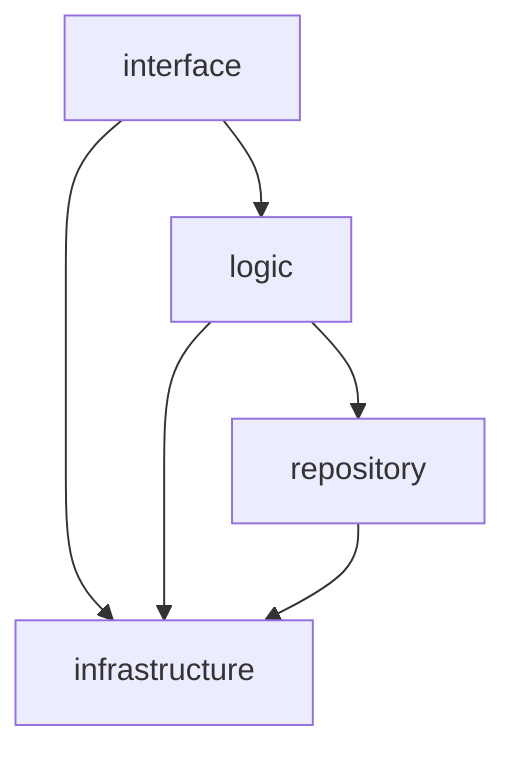
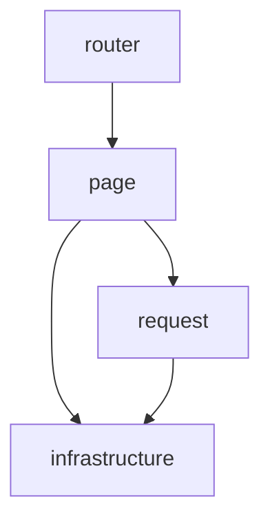

# nail_new — Refactoring Guide

`nail_new` is a complete refactoring of the `nail` project. Every line of the
original code may be legacy baggage; do not take any line at face value. The
following rules must be observed throughout the refactoring.

## 1. Environment

- Development environment: WSL Debian, working directory `/home/qkun`.

## 2. Technology Stack

- Frontend: Leptos CSR (client-side rendering). Proxy: pingap (static assets +
  reverse proxy). Backend: axum, embedding SeekStorm (search), agdb (database),
  moka (cache).

### 2.1 Library sources (trusted, on disk)

Base path `<base>` = `~/.cargo/registry/src/index.crates.io-1949cf8c6b5b557f/`.
The version in use is pinned by each crate's `Cargo.lock`
(`code/{common,back,front}/Cargo.lock`); re-check the lock after every
`cargo add`. The registry may hold several versions; the locks pin the ones in
use.

| Library | Version (as of 2026-08-13) | Source directory |
| --- | --- | --- |
| agdb | 0.13.2 | `<base>/agdb-0.13.2/` |
| axum | 0.8.9 | `<base>/axum-0.8.9/` |
| moka | 0.12.16 | `<base>/moka-0.12.16/` |
| ascon-xof128 | 0.2.1 | `<base>/ascon-xof128-0.2.1/` |
| pso-vdf | 0.2.3 | `<base>/pso-vdf-0.2.3/` |
| uuid | 1.24.0 | `<base>/uuid-1.24.0/` |
| time | 0.3.55 | `<base>/time-0.3.55/` |
| serde | 1.0.229 | `<base>/serde-1.0.229/` |
| seekstorm | 3.3.5 (in use) | `<base>/seekstorm-3.3.5/` |
| cedar-policy | 4.12.0 (in use) | `<base>/cedar-policy-4.12.0/` |
| leptos | 0.8.20 (Phase 4, not yet added) | `<base>/leptos-0.8.20/` |

## 3. Project Skeleton (fixed, must not be changed)

Full tree: `document/skeleton.md`. Top level: `code/{back,common,front}`,
`configuration/`, `data/`, `log/`, `document/`, `test/`; every module is a
same-named `.rs` + folder pair (§4.4). The skeleton fixes only the top-level
entry files per layer; the module trees beneath the backend and frontend
layers must be designed fresh — never copied from the legacy `nail` layouts
(§4.1, §4.2).

## 4. Architecture

### 4.1 Backend layering and dependency direction (mandatory)

The module trees beneath `interface`, `logic`, `repository`, and
`infrastructure` must be designed fresh; copying the legacy division
(`api.rs`-style route surface, `repo/`, `authorization/`, or any other legacy
arrangement) is absolutely forbidden. A module boundary is valid only when
justified by the layer's responsibilities and its callers — "the legacy code
did it this way" is never an acceptable justification.

### 4.2 Frontend layering and dependency direction (mandatory)

- `main.rs` is the composition root: wires the layers (runtime-config signals,
  mounts the router).
- `router` maps URL paths to `page` components only.
- `page` renders UI and holds local state; it calls the backend only through
  `request`.
- `request` owns every HTTP call, session-token handling, and `{code, data,
  message}` envelope unwrapping.
- `infrastructure` holds browser/wasm primitives (compile-time config, runtime
  config fetch, storage, PoW); both `page` and `request` may reach it.

The module trees beneath `router`, `page`, `request`, and `infrastructure`
must be designed fresh; copying the legacy `nail` frontend's module division
is absolutely forbidden. The same boundary-validity rule as §4.1 applies.

### 4.3 Shared crate (`common`)

`common` holds data structures and methods shared by front and back. Both
depend on it; it depends on nothing internal.

### 4.4 Module organization

- Never use `mod.rs`. Every module = a same-named `.rs` file + folder.
- Prefer well-formed trees; if a directory holds more than 16 files, deepen
  the hierarchy.

## 5. Coding Standards

### 5.1 Language

- English only — code, docs, comments, UI strings.

### 5.2 Naming

- No shorthand or abbreviations; names detailed, complete, self-explanatory.
  Loop variables (`i`, `j`, `k`) are the only exception.
- **CRUD-only verbs for resource operations.** Every backend resource (user,
  article, version, comment, tag, role, permission, session, challenge) is
  operated on with exactly `create`/`read`/`update`/`delete`. Collection reads
  are `read` (never `list`), paginated through query parameters.
- **Node operations, not frontend flow vocabulary.** Wire flow terms (e.g.
  `intent=authenticate|change_email|deregister`) never appear as backend
  identifiers — name the node op (`create_user`, `update_user_email`,
  `delete_user`, `read_session`).
- **Enforcement depth.** `interface` is strictest: one `<verb>_<resource>`
  handler per route. `logic` top-level entry points use the same verbs.
  `repository`/`infrastructure` helpers keep their own precise terms (`sync`,
  `transfer`, `owner_of`).

### 5.3 Size limits

- Single file: at most 512 lines. Single function: at most 256 lines.
  Nesting: at most 4 levels (function-body braces = level 0).

### 5.4 General principles

- Concise, clear, correct; longer-than-necessary code needs strong
  justification.
- Prefer pure (or near-pure) functions.
- No hardcoding; anything configurable lives in toml.
- Don't chase dead code during migration; batch-remove it in one pass after
  the refactoring is complete (final task of Phase 5), then the zero-warning
  gate applies.

### 5.5 Comments

- Code must be self-explanatory. Comments only for non-obvious intent,
  constraints, or tradeoffs. A comment that restates the code is a defect.

## 6. Robustness and Security

- Panic-free: never `unwrap`, `expect`, or similar.
- Errors propagate with `?`; convert error types only at layer boundaries; the
  interface layer maps the final error into the `{code, data, message}`
  envelope.
- Search IDs and tokens: UUIDv7. Hashing: ascon family only.

## 7. Design Order

- Define data structures first, then the logic around them — for request/
  response payloads, the database node/edge shapes, and the cache key-value
  layout.

## 8. Engineering Practices

### 8.1 Evidence discipline

- Facts come from source and probes, never guessing. Read the source first;
  when ambiguous or untrustworthy, write a probe test. Probes outrank source,
  source outranks guessing.
- Don't hand-patch alleged library defects; read the library source (§2.1)
  and find the official solution first.

### 8.2 Treating the legacy code

- Verify every legacy line individually; don't assume it is correct.
- Don't copy how it was written: read the library source, confirm with probe
  tests, aim for more elegant, simpler, higher-performance, clearer code.
- **Strong references** — the `nail` database design, cache design,
  email-sending business logic, and backend API design. Read and study them
  carefully BEFORE implementing (the pre-implementation counterpart of §8.3);
  build on them rather than re-deriving them.

### 8.3 Quality gate

After each large module, compare new vs legacy on readability, correctness,
elegance, conciseness, performance — grounded in source + probes, not
impressions. If the new code is inferior, weigh the fix cost; when worthwhile,
correct it and re-run the full suite, then report to the owner. A quality
gate, not a license to copy — the legacy code remains untrusted.

## 9. Build and Dependencies

- Scaffold the top-level structure first; add dependencies one by one with
  `cargo add`, alphabetical, latest non-conflicting versions.

## 10. Frontend Rules

- Build with Leptos in CSR mode. Pages must not use any CSS or style.
- Deployment parameters (e.g. `api_base_url`) are embedded at compile time
  from toml and fail fast. All other configuration is fetched at runtime from
  `GET /config/read`, with compile-time defaults as fallback until the first
  fetch completes — the backend stays authoritative.

## 11. Backend Rules

- Every response is `{code, data, message}`: code = HTTP status, message =
  reason, data = payload.
- Configuration is read from toml at startup (editing `configuration/` needs
  no rebuild); secrets stay out of version control.
- Provide a config-read endpoint (`/config/read`) serving the runtime
  configuration the frontend fetches.
- Logging: `tracing` with `tracing-subscriber`, writing to `log/`.

## 12. Testing

- Test every function across all of its cases. Exhaustively when the cost is
  low; otherwise cover every boundary case plus many randomized regular cases.

## 13. Agent Workflow

- Use `grep` only in the terminal (`/bin/sh`); never the built-in grep tool.
- The `cd` parameter must be a `qkun`-prefixed path (e.g. `qkun/nail_new`) or
  the absolute path `/home/qkun/nail_new`.
- Never use the diagnostics tool. Diagnose only by reading code, running cargo
  commands, and running tests.
- Update `document/handoff.md` at the end of every completed slice and phase,
  before reporting to the owner: record current state, what was done, what
  comes next. The handoff must never go stale.
