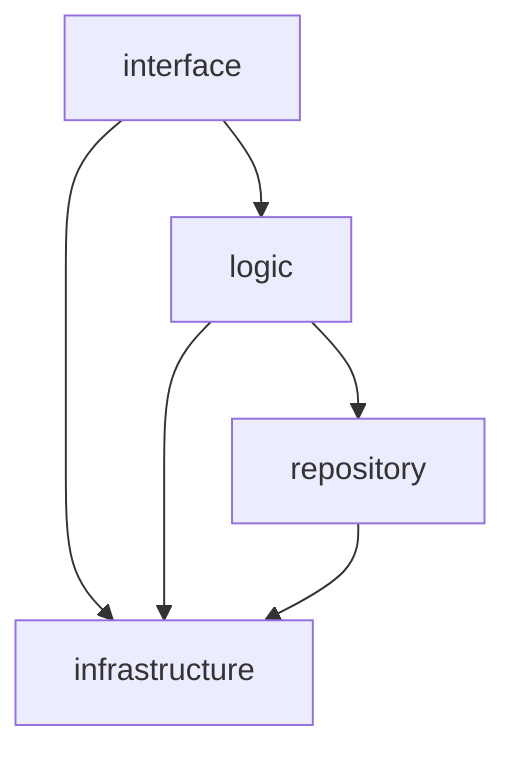
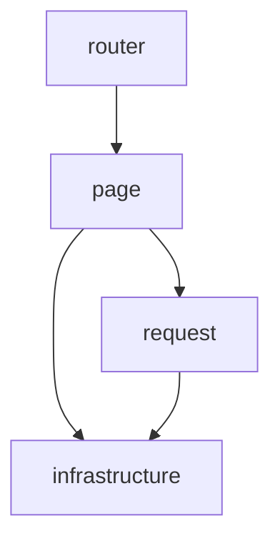

# nail

`nail` is a versioned-article knowledge base: authors publish articles as
versioned revisions, attach notes and comments, tag content, and search across
the whole tree. Access is protected by email-challenge authentication with
proof-of-work, Cedar policy authorization, and PDF download with short-lived
tokens.

This README is the project constitution: its layering, standards, and build
rules are mandatory. Agents must read it (and `document/INDEX.md`) before any
work — see `AGENTS.md`.

## 1. Repository layout

- `code/` — the workspace: `back` (axum server), `front` (Leptos CSR app),
  `common` (shared crate), `proxy` (pingap binary).
- `configuration/` — all runtime config as toml; `proxy/` holds the pingap
  config.
- `data/` — agdb database, SeekStorm search index, PDF storage. The dev
  database is reset and reseeded at startup; deleting it forces a fresh init.
- `log/` — backend and proxy logs.
- `document/` — project docs, indexed by `INDEX.md`: code workflow
  (`workflow.md`), progress tracker (`handoff.md`), run guide (`run.md`),
  decisions (`decisions.md`).
- `test/` — shared unit-test sources pulled in by the crates via `#[path]`.

## 2. Architecture

Layering is mandatory; dependencies point strictly inward as shown.

### 2.1 Backend layering and dependency direction

- `main.rs` is the composition root: loads config, initializes logging, seeds
  the dev database, starts the server.
- `interface` — the axum route surface: one `<verb>_<resource>` handler per
  route, request extraction, response envelope.
- `logic` — business rules, authorization, search tree assembly, pagination.
- `repository` — persistence: agdb graph access, the SeekStorm index, the moka
  cache.
- `infrastructure` — config, logging, email/SMTP, PDF, server bootstrap.

### 2.2 Frontend layering and dependency direction

- `main.rs` is the composition root: wires runtime-config signals and mounts the
  router.
- `router` maps URL paths to `page` components only.
- `page` renders UI and holds local state; it calls the backend only through
  `request`.
- `request` owns every HTTP call, session-token handling, and the
  `{code, data, message}` envelope unwrapping.
- `infrastructure` holds browser/wasm primitives (compile-time config, runtime
  config fetch, storage, PoW); both `page` and `request` may reach it.

### 2.3 Shared crate (`common`)

`common` holds data structures and methods shared by front and back (hash, PoW,
name, tag, text, search, time, request/response). Both depend on it; it depends
on nothing internal.

### 2.4 Module organization

- Never use `mod.rs`. Every module = a same-named `.rs` file + folder.
- If a directory holds more than 16 files, deepen the hierarchy.

## 3. Technology stack

- Frontend: Leptos CSR built with trunk; proxy: pingap (static assets + reverse
  proxy, forwards `/api/*` to the backend).
- Backend: axum, agdb (graph), SeekStorm (search), moka (cache),
  cedar-policy (authorization), lettre (SMTP), tokio, tracing.
- Hashing: ascon family; IDs and tokens: UUIDv7.
- Versions are pinned by each crate's `Cargo.lock`. The local cargo registry
  (`~/.cargo/registry/src/index.crates.io-*/`) holds the pinned crate sources
  for reference.

## 4. Coding standards

### 4.1 Language

English only — code, docs, comments, UI strings.

### 4.2 Naming

- No shorthand or abbreviations; names detailed, complete, self-explanatory.
  Loop variables (`i`, `j`, `k`) are the only exception.
- **CRUD-only verbs for resource operations.** Every backend resource (user,
  article, version, comment, tag, role, permission, session, challenge) is
  operated on with exactly `create`/`read`/`update`/`delete`. Collection reads
  are `read` (never `list`), paginated through query parameters.
- **Node operations, not frontend flow vocabulary.** Wire flow terms (e.g.
  `intent=authenticate|change_email|deregister`) never appear as backend
  identifiers — name the node op (`create_user`, `update_user_email`,
  `delete_user`, `read_session`).
- **Enforcement depth.** `interface` is strictest: one `<verb>_<resource>`
  handler per route. `logic` top-level entry points use the same verbs.
  `repository`/`infrastructure` helpers keep their own precise terms (`sync`,
  `transfer`, `owner_of`).

### 4.3 Size limits

- Single file: at most 512 lines. Single function: at most 256 lines.
  Nesting: at most 4 levels (function-body braces = level 0).

### 4.4 General principles

- Concise, clear, correct; longer-than-necessary code needs strong
  justification.
- Prefer pure (or near-pure) functions.
- No hardcoding; anything configurable lives in toml.
- No dead code; the zero-warning gate applies to every build.

### 4.5 Comments

Code must be self-explanatory. Comments only for non-obvious intent,
constraints, or tradeoffs. A comment that restates the code is a defect.

## 5. Robustness and security

- Panic-free: never `unwrap`, `expect`, or similar.
- Errors propagate with `?`; convert error types only at layer boundaries; the
  interface layer maps the final error into the `{code, data, message}` envelope.
- Search IDs and tokens: UUIDv7. Hashing: ascon family only.
- Authorization is enforced in the logic layer against Cedar policies; every
  request goes through a principal session.

## 6. Configuration

Config lives as toml under `configuration/`, never hardcoded:

- `server.toml` — backend runtime config (listen addr, paths, limits, logging),
  read at startup; editing needs no rebuild.
- `front.toml` — frontend deployment params (e.g. `api_base_url`), embedded at
  compile time via `include_str!` and fail fast.
- `email.toml` — allowed email domains.
- `smtp.toml` — SMTP credentials (secrets). Gitignored; the committed template
  is `smtp.toml.example`.

The backend serves a config-read endpoint (`/config/read`) holding the runtime
configuration the frontend fetches.

## 7. Backend rules

- Every response is `{code, data, message}`: code = HTTP status, message =
  reason, data = payload.
- Logging: `tracing` with `tracing-subscriber`, writing to `log/`, with daily
  pruning.

## 8. Frontend rules

- Build with Leptos in CSR mode. Pages must not use any CSS or style.
- Deployment parameters are embedded at compile time and fail fast. All other
  configuration is fetched at runtime from `/config/read`, with compile-time
  defaults as fallback until the first fetch completes — the backend stays
  authoritative.

## 9. Design order

Define data structures first, then the logic around them — for request/response
payloads, the database node/edge shapes, and the cache key-value layout.

## 10. Testing

- Test every function across all of its cases. Exhaustively when the cost is
  low; otherwise cover every boundary case plus many randomized regular cases.
- Unit tests live under `test/unit/{common,back,front}` and are pulled into the
  crates via `#[path]`.
- Run `cargo test` inside `code/back`, `code/common`, and `code/front`; keep the
  zero-warning gate (`cargo clippy`, `cargo fmt`) green. The clippy gate runs
  plain `cargo clippy` (no `--all-targets`) so test code is exempt.

## 11. Building and running

- Full-stack restart (build frontend, start backend + proxy, health checks):
  follow `document/run.md`.
- Backend alone: `cargo run --bin nail_back` (from `code/back`); seed sample
  data with `cargo run --bin nail_back -- seed-samples [count]`.
- Frontend: `trunk build` (from `code/front`); served as static files by the
  proxy.

## 12. Dependencies

- Add dependencies one by one with `cargo add`, alphabetical, latest
  non-conflicting versions; commit `Cargo.lock` so builds are reproducible.
- For any third-party crate question, read the pinned crate source in the local
  cargo registry first; when it is ambiguous or untrustworthy, write a probe
  test rather than guessing.

## 13. Documentation

- `document/INDEX.md` is the entry point: read order and what each doc covers.
- `document/workflow.md` defines the mandatory code-execution loop.
- `document/handoff.md` tracks current state, what was done, and what comes
  next.
- `document/decisions.md` records the decided architecture and conventions.
- `document/run.md` is the build/run/health-check guide.