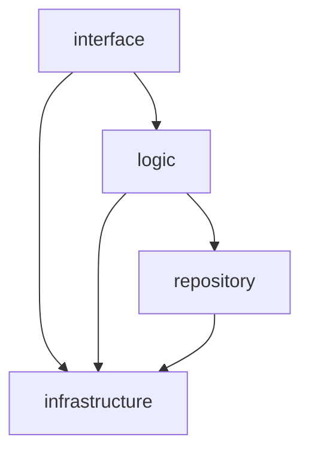
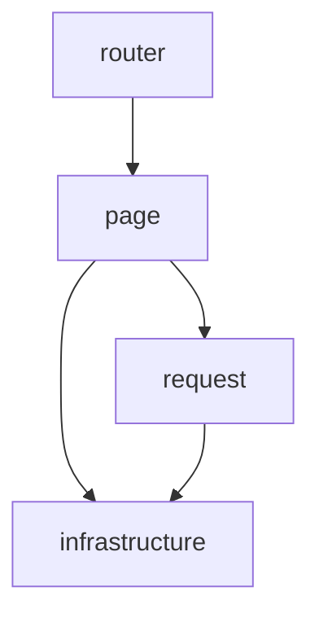

# nail_new — Refactoring Guide

`nail_new` is a complete refactoring of the `nail` project. Every line of the
original code may be legacy baggage; do not take any line at face value. The
following rules must be observed throughout the refactoring.

## 1. Environment

- Development environment: WSL Debian, working directory `/home/qkun`.

## 2. Technology Stack

- Frontend: Leptos in CSR (client-side rendering) mode.
- Proxy: pingap, serving static assets and acting as a reverse proxy.
- Backend: axum, embedding SeekStorm (search engine), agdb (database), and
  moka (cache).

### 2.1 Library sources (trusted, on disk)

Every library's source code is available locally for reading — this is the
TRUSTED source mandated by §8. Base path:
`~/.cargo/registry/src/index.crates.io-1949cf8c6b5b557f/` (abbreviated
`<base>` below). Versions follow each crate's `Cargo.lock`
(`code/common/Cargo.lock`, `code/back/Cargo.lock`, `code/front/Cargo.lock`
once it exists); re-check the lock after every `cargo add`. The registry may
hold several versions of each crate; the lock files pin the ones in use.

| Library | Version (as of 2026-08-13) | Source directory |
| --- | --- | --- |
| agdb | 0.13.2 | `<base>/agdb-0.13.2/` |
| axum | 0.8.9 | `<base>/axum-0.8.9/` |
| moka | 0.12.16 | `<base>/moka-0.12.16/` |
| ascon-xof128 | 0.2.1 | `<base>/ascon-xof128-0.2.1/` |
| pso-vdf | 0.2.3 | `<base>/pso-vdf-0.2.3/` |
| uuid | 1.24.0 | `<base>/uuid-1.24.0/` |
| time | 0.3.55 | `<base>/time-0.3.55/` |
| serde | 1.0.229 | `<base>/serde-1.0.229/` |
| seekstorm | 3.3.5 (Phase 3, not yet added) | `<base>/seekstorm-3.3.5/` |
| cedar-policy | 4.12.0 (Phase 3, not yet added) | `<base>/cedar-policy-4.12.0/` |
| leptos | 0.8.20 (Phase 4, not yet added) | `<base>/leptos-0.8.20/` |

## 3. Project Skeleton (fixed, must not be changed)

```text
nail_new/
|-- README.md
|-- code/
|   |-- back/
|   |   |-- Cargo.toml
|   |   `-- src/
|   |       |-- main.rs
|   |       |-- interface.rs
|   |       |-- interface/
|   |       |-- logic.rs
|   |       |-- logic/
|   |       |-- repository.rs
|   |       |-- repository/
|   |       |-- infrastructure.rs
|   |       `-- infrastructure/
|   |-- common/
|   |   |-- Cargo.toml
|   |   `-- src/
|   |       |-- lib.rs
|   |       |-- text.rs
|   |       |-- text/
|   |       |-- name.rs
|   |       |-- name/
|   |       |-- tag.rs
|   |       |-- tag/
|   |       |-- response.rs
|   |       |-- response/
|   |       |-- hash.rs
|   |       |-- hash/
|   |       |-- time.rs
|   |       |-- time/
|   |       |-- pow.rs
|   |       |-- pow/
|   |       |-- request.rs
|   |       |-- request/
|   |       |-- search.rs
|   |       `-- search/
|   `-- front/
|       |-- Cargo.toml
|       `-- src/
|           |-- main.rs
|           |-- page.rs
|           |-- page/
|           |-- request.rs
|           |-- request/
|           |-- router.rs
|           |-- router/
|           |-- infrastructure.rs
|           `-- infrastructure/
|-- configuration/
|-- data/
|-- log/
|-- document/
`-- test/
```

> Note: the `common` crate's module list was settled in Phase 2 — `text`,
> `name`, `tag`, `response`, `hash`, `time`, `pow`, `request`, `search`,
> each a same-named `.rs` + folder pair (§4.4). The skeleton fixes only the
> top-level entry files per layer; the module trees beneath the backend and
> frontend layers are not prescribed here and must be designed fresh — never
> copied from the legacy `nail` layouts (§4.1, §4.2).

## 4. Architecture

### 4.1 Backend layering and dependency direction (mandatory)



The module trees beneath `interface`, `logic`, `repository`, and
`infrastructure` must be designed fresh for `nail_new`; it is absolutely
forbidden to copy the legacy `nail` backend's module division into these
layers (its `api.rs`-style route surface, `repo/`, `authorization/`, or
any other legacy arrangement). A module boundary is valid only when
justified by the new layer's responsibilities and its callers — "the
legacy code did it this way" is never an acceptable justification.

### 4.2 Frontend layering and dependency direction (mandatory)

Derived from the `nail` frontend:

- `main.rs` is the composition root: it wires the layers (provides the
  runtime-config signals, mounts the router).
- `router` only maps URL paths to `page` components.
- `page` renders UI and holds local state; it calls the backend only through
  `request`.
- `request` owns every HTTP call, session-token handling, and `{code, data,
  message}` envelope unwrapping.
- `infrastructure` holds browser/wasm-specific primitives (compile-time
  config, runtime config fetching, storage, PoW computation); both `page` and
  `request` may reach it.



The module trees beneath `router`, `page`, `request`, and `infrastructure`
must be designed fresh for `nail_new`; it is absolutely forbidden to copy
the legacy `nail` frontend's module division into these layers. A module
boundary is valid only when justified by the new layer's responsibilities
and its callers — "the legacy code did it this way" is never an acceptable
justification.

### 4.3 Shared crate (`common`)

`common` holds data structures and methods shared by front and back. Both
`back` and `front` depend on it; it depends on nothing internal.

### 4.4 Module organization

- Never use `mod.rs`. Every module must consist of a same-named `.rs` file and
  a same-named folder.
- Prefer a well-formed tree structure; deep module hierarchies are allowed.
  Flat, loosely organized structures are discouraged: if a directory holds more
  than 16 files, reconsider deepening the hierarchy.

## 5. Coding Standards

### 5.1 Language

- The project is English-only. No non-English documentation, comments, or code
  may appear anywhere.

### 5.2 Naming

- No shorthand or abbreviations in variable, function, file, module, or
  directory names. Names must be detailed, complete, and self-explanatory.
- Universally accepted loop variables (e.g. `i`, `j`, `k`) are the only
  exception.
- **CRUD-only verbs for resource operations.** Every backend resource (user,
  article, version, comment, tag, role, permission, session, challenge) is
  operated on with exactly four verbs: `create`, `read`, `update`, `delete`.
  Collection reads are still `read` (never `list`), paginated through query
  parameters (`read_users(page, limit)`).
- **Node operations, not frontend flow vocabulary.** Flow terms the frontend
  exposes on the wire (e.g. the `intent=authenticate|change_email|deregister`
  selector) must never appear as a backend identifier. The backend names the
  underlying node operation instead (`create_user`, `update_user_email`,
  `delete_user`, `read_session`, `delete_session`).
- **Enforcement depth.** The `interface` layer is the strictest: one
  `<verb>_<resource>` handler per route (`create_user`, `read_user`,
  `read_users`, `update_user`, `delete_user`, ...). The `logic` layer's
  top-level entry points use the same verbs. Below them, `repository` and
  `infrastructure` helpers may use their own precise terminology (`sync`,
  `transfer`, `owner_of`, ...).

### 5.3 Size limits

- Single file: at most 512 lines.
- Single function: at most 256 lines.
- Function nesting: at most 4 levels; the function body's braces count as
  level 0.

### 5.4 General principles

- Keep code concise, clear, and correct. Any code written longer than necessary
  must have a strong justification.
- Prefer pure (or near-pure) functions over others: they are easy to test and
  form the foundation of business logic.
- No hardcoding. Anything configurable must live in toml configuration files.
- Do not chase dead or unused code during the migration; interim code may
  still be consumed by later slices or rewritten. Batch-remove all dead code
  in one dedicated pass after the entire refactoring is complete (the final
  task of Phase 5), then the zero-warning gate is enforced.

### 5.5 Comments

- Code must be self-explanatory: names and structure carry the meaning, so
  the logic reads clearly with no comments or very few.
- Comments are allowed only where they explain non-obvious intent,
  constraints, or tradeoffs that the code itself cannot express. Never
  restate the code; a comment that merely repeats the code is a defect.

## 6. Robustness and Security

- Panic-free code: never use `unwrap`, `expect`, or similar constructs.
- Errors propagate with `?`. Never swallow errors or unwrap manually; convert
  error types only at layer boundaries (contextual `anyhow`-style wrapping;
  typed error enums only where callers must distinguish cases). The backend's
  interface layer maps the final error into the `{code, data, message}`
  envelope.
- Search IDs and tokens must use UUIDv7.
- All hashing must use the ascon family.

## 7. Design Order

- Define data structures first, then write business logic around them. This
  applies to:
  - frontend-backend communication: the structure of request and response
    payloads;
  - the database: node and edge structures and their attributes;
  - cache design: key-value layout.

## 8. Engineering Practices

### 8.1 Evidence discipline

- Establish facts from source and probes: never guess. Read the source first;
  when the source is ambiguous or untrustworthy, write a probe test to observe
  actual behavior. Probes outrank source, and source outranks guessing; facts
  are constructed from probes and source together.
- Do not patch alleged library defects with hand-written workarounds. Explore
  the library's source code (on disk — see §2.1) and look for the official
  solution first; an apparent defect is usually a lack of familiarity with the
  source.

### 8.2 Treating the legacy code

- Verify every line of the original `nail` code individually; do not assume any
  of it is correct.
- Do not copy how the original `nail` code was written. Proceed carefully, step
  by step: read the library source, then confirm the best approach with probe
  tests — aiming for more elegant, simpler, higher-performance, and clearer
  code.
- The `nail` database design, cache design, and email-sending business logic,
  and its backend API design (semantically consistent), are strong references:
  they were produced through extensive argumentation and repeated study of
  library source code and are close to best practice. Build on them rather
  than re-deriving them.
- Before implementing any of the designated strong-reference areas (the
  `nail` database design, cache design, email-sending business logic, or
  backend API design), read and study the legacy implementation carefully
  first — understand its reasoning before writing new code. This is the
  pre-implementation counterpart of the post-completion comparison (§8.3).

### 8.3 Quality gate

- After completing a large module (a domain slice or a phase), compare the
  new code against the corresponding legacy code on readability, correctness,
  elegance, conciseness, and performance. Ground the comparison in facts, not
  impressions: wherever behavior or performance is in doubt, read the trusted
  library source and write probe tests to verify before judging. If the new
  code is inferior in any respect, weigh the cost of fixing it; when
  worthwhile, correct the code and re-run the full test suite, then report
  the comparison and the fixes to the owner. This is a quality gate, not a
  license to copy — the legacy code remains untrusted.

## 9. Build and Dependencies

- Scaffold the top-level structure first, then add dependencies one by one with
  `cargo add`, in alphabetical order, always the latest versions that do not
  conflict.

## 10. Frontend Rules

- Build with Leptos in CSR mode.
- Frontend pages must not use any CSS or style.
- Deployment parameters (e.g. `api_base_url`) are embedded at compile time
  from toml and fail fast. All other configuration is fetched at runtime from
  the backend config endpoint (`GET /config/read`), with compile-time defaults
  as fallback until the first fetch completes — the backend stays
  authoritative.

## 11. Backend Rules

- Every backend response must be `{code, data, message}`:
  - `code`: the HTTP status code;
  - `message`: the reason description;
  - `data`: the data the frontend needs.
- Configuration is read from toml at startup, so editing `configuration/`
  needs no rebuild; secrets stay out of version control.
- Provide a config-read endpoint (`/config/read`) serving the runtime
  configuration the frontend fetches.
- Logging: `tracing` with `tracing-subscriber`, writing to the `log/`
  directory.

## 12. Testing

- Test every function across all of its cases.
- Exhaustively enumerate cases when the cost is low; otherwise cover every
  boundary case plus a large number of randomized regular cases.

## 13. Agent Workflow

- Use `grep` only in the terminal (`/bin/sh`); never use the built-in grep
  tool.
- The `cd` parameter must be a `qkun`-prefixed path (e.g. `qkun/nail_new`) or
  the absolute path `/home/qkun/nail_new`.
- Do not use the diagnostics tool. Diagnose only by reading code, running cargo
  commands, and running tests. This rule applies universally.
- Update `document/handoff.md` at the end of every completed slice and every
  completed phase, before reporting to the owner: record the current state,
  what was done, and what comes next. The handoff must never go stale.
